# OnlyWan API 调用流程图

## 1. 系统整体架构流程图

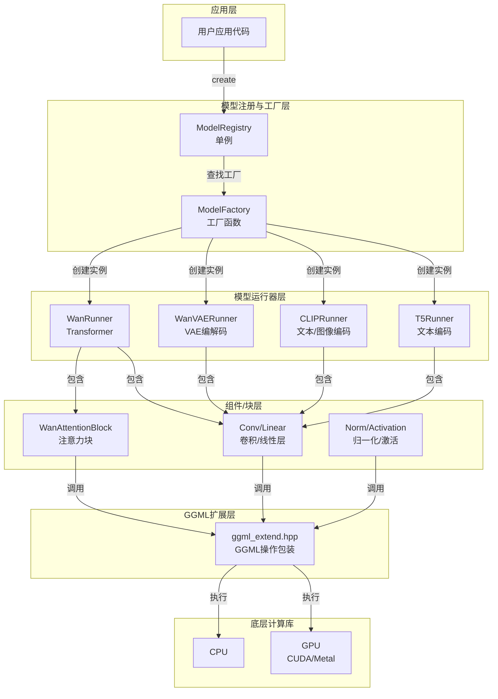

## 2. 模型加载流程图

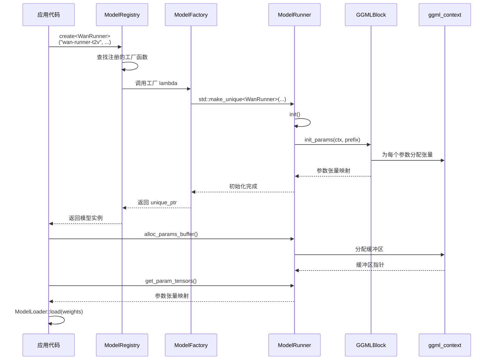

## 3. T2V (文本到视频) 推理流程图

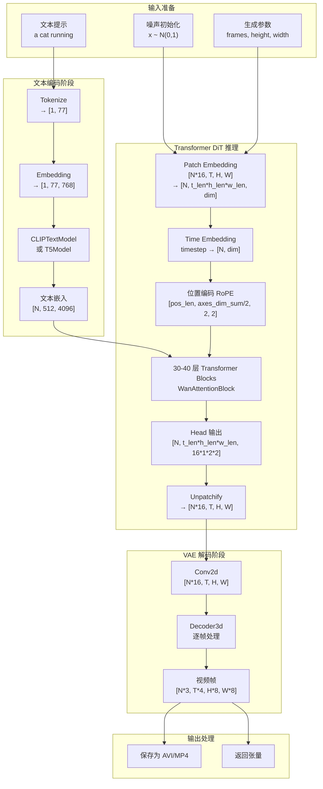

## 4. I2V/TI2V (图像到视频) 流程差异

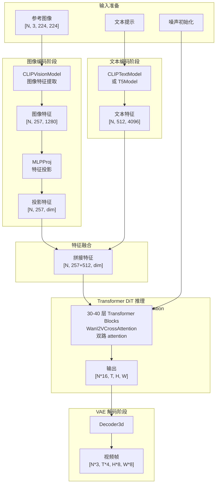

## 5. WanAttentionBlock 内部流程

```mermaid
graph TD
    subgraph Input["输入"]
        X["x: [N, seq_len, dim]"]
        Context["context: [N, ctx_len, dim]"]
        Time["time_emb: [N, dim]"]
    end

    subgraph SelfAttn["Self-Attention<br/>with RoPE"]
        QKV["生成 Q, K, V"]
        RoPE["应用 RoPE<br/>旋转位置编码"]
        Attn["Attention<br/>softmax(QK^T/√d)V"]
        SelfOut["Self-Attn 输出"]
    end

    subgraph CrossAttn["Cross-Attention"]
        CrossQKV["生成 Q, K, V<br/>K,V 来自 context"]
        CrossAttn["Cross-Attention<br/>softmax(QK^T/√d)V"]
        CrossOut["Cross-Attn 输出"]
    end

    subgraph FFN["FFN<br/>Linear + GELU + Linear"]
        Linear1["Linear(dim → 4*dim)"]
        GELU["GELU 激活"]
        Linear2["Linear(4*dim → dim)"]
        FFNOut["FFN 输出"]
    end

    subgraph Residual["残差连接"]
        Add1["x + Self-Attn"]
        Norm1["LayerNorm"]
        Add2["Norm1 + Cross-Attn"]
        Norm2["LayerNorm"]
        Add3["Norm2 + FFN"]
        Out["最终输出"]
    end

    X --> QKV
    QKV --> RoPE
    RoPE --> Attn
    Attn --> SelfOut

    Context --> CrossQKV
    CrossQKV --> CrossAttn
    CrossAttn --> CrossOut

    Time --> FFN

    SelfOut --> Add1
    X --> Add1
    Add1 --> Norm1

    CrossOut --> Add2
    Norm1 --> Add2
    Add2 --> Norm2

    FFNOut --> Add3
    Norm2 --> Add3
    Add3 --> Out

    Linear1 --> GELU
    GELU --> Linear2
    Linear2 --> FFNOut
```

## 6. VAE 解码流程

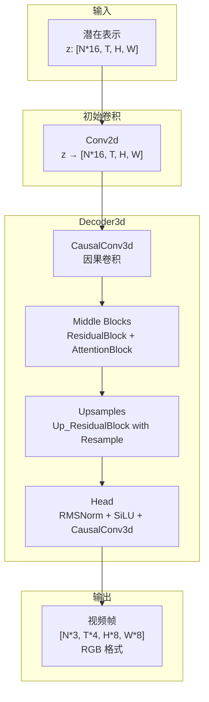

## 7. 模型注册机制流程

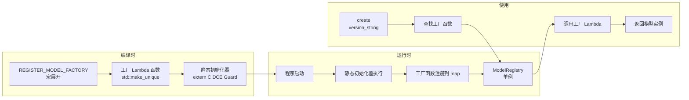

## 8. 张量形状变换链 (T2V)

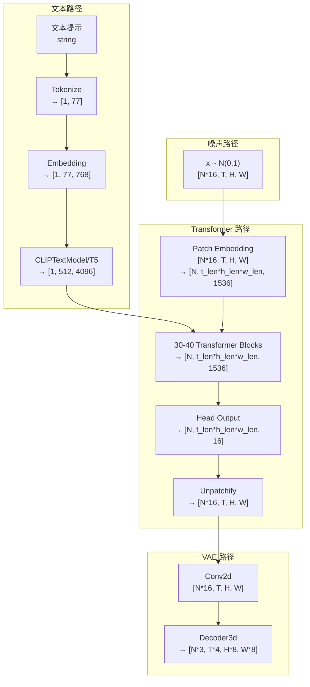

## 9. 计算图构建与执行流程

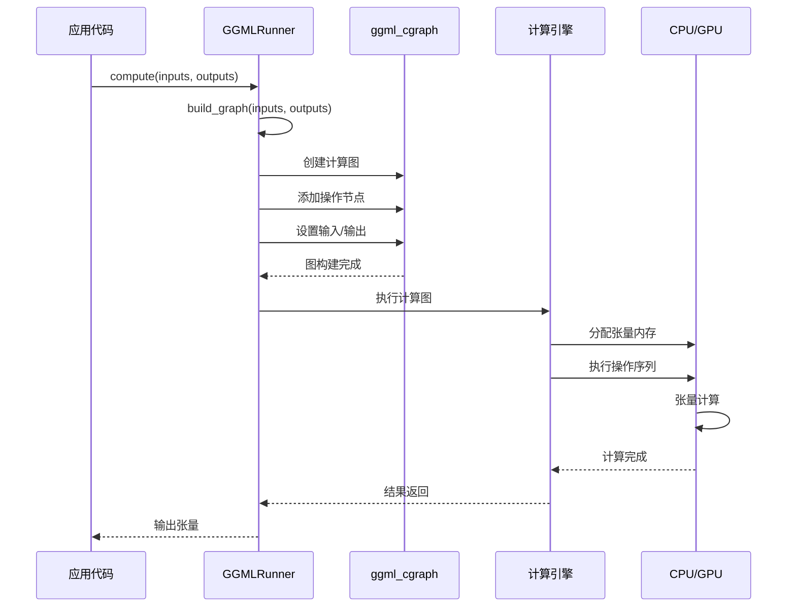

## 10. 错误处理流程

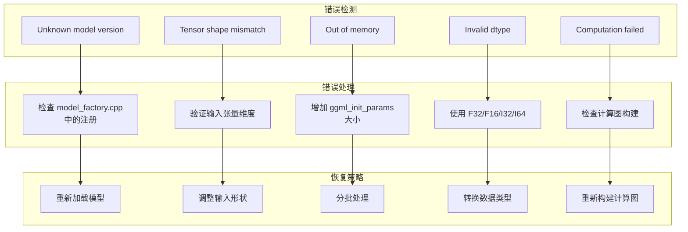

## 11. 内存管理流程

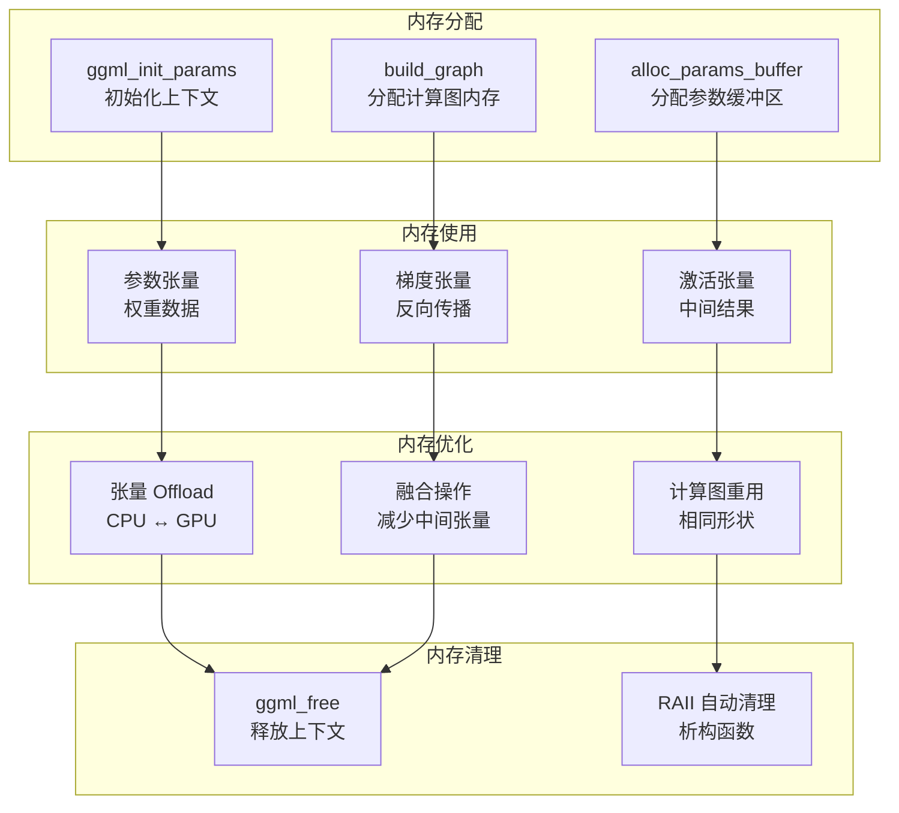

## 12. 完整推理流程 (端到端)

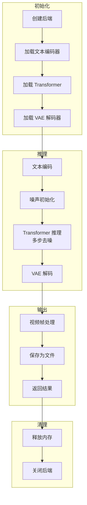

---

## 图表说明

### 1. 系统架构流程图
展示了整个系统的分层结构，从应用层到底层计算库的完整调用链。

### 2. 模型加载流程图
详细展示了模型从创建到初始化的完整过程，包括工厂模式的应用。

### 3. T2V 推理流程图
展示了文本到视频的完整推理过程，包括文本编码、Transformer 推理和 VAE 解码三个主要阶段。

### 4. I2V/TI2V 流程差异
展示了图像到视频的推理过程，与 T2V 的主要差异在于额外的图像编码和特征融合阶段。

### 5. WanAttentionBlock 内部流程
详细展示了单个注意力块的内部结构，包括自注意力、交叉注意力和 FFN 三个子模块。

### 6. VAE 解码流程
展示了 VAE 解码器的内部结构，包括因果卷积、中间块、上采样和头部输出。

### 7. 模型注册机制流程
展示了编译时和运行时的模型注册过程，以及工厂模式的实现。

### 8. 张量形状变换链
展示了从输入到输出的完整张量形状变换过程。

### 9. 计算图构建与执行流程
展示了 GGML 计算图的构建和执行过程。

### 10. 错误处理流程
展示了常见错误的检测、处理和恢复策略。

### 11. 内存管理流程
展示了内存的分配、使用、优化和清理过程。

### 12. 完整推理流程
展示了从初始化到输出的完整端到端推理过程。
